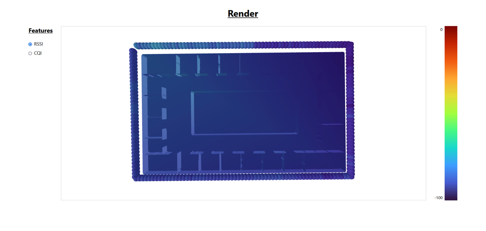

# Introduction

This is the repository containing the full stack application for generating 5G coverage heatmaps within building. Currently, the application supports rendering RSSI and CQI heatmaps.

# Features

The application provides an UI for training models to predict RF signals within buildings, and also generating 3D coverage heatmaps using the trained models.

# Datasets

The internal and external walktest datasets used in this project can be found [here](https://drive.google.com/drive/folders/12OCSR71MXmgd0E6TJntm8-tpmoJnNWDZ?usp=sharing)

# Quickstart

Clone the repository locally and follow the steps below to set up the backend and frontend.

## Backend

1. `cd backend`
2. Create a virtual environment with python >= 3.11
3. Run `pip install -r requirements.txt` to install all dependencies
4. Run `python3 main.py` to start the Flask server. By default, the Flask app runs on port 5000

## Frontend

1. `cd frontend`
2. Run `npm install` to install the dependencies
3. Run `npm run dev` to start the Vite server